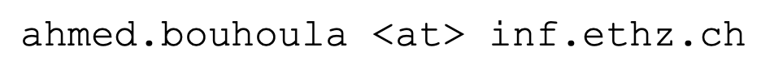

## About Me

I am a PhD Student at the Department of Computer Science at ETH Zurich. I am part of the [Information Security Group](https://infsec.ethz.ch/), supervised by [Prof. David Basin](http://people.inf.ethz.ch/basin/).

## Education

Year | Award | Category
-----|-------|--------
2022- | ETH Zurich | Doctoral Student
2020-2022 | ETH Zurich | M.Sc. Computer Science
2017-2020 | Ecole Polytechnique | Engineering Degree
2015-2017 | Lycée Louis-le-Grand | *Prépa* (MP)

## Publications

* Automated, Large-Scale Analysis of Cookie Notice Compliance
  * *Ahmed Bouhoula, Karel Kubicek, Amit Zac, Carlos Cotrini, David Basin*
  * To appear at USENIX'24.
  * [paper website](https://ahmedbouhoula.github.io/post/automated.html)

* A Security Policy Query Engine for Fully Automated Resolution of Anomalies in Firewall Configurations
  * *Ahmed Bouhoula, Anis Yazidi*
  * IEEE NCA 2016.
  * [doi](https://ieeexplore.ieee.org/document/7778596)

## Teaching

* Algorithms Lab
* Formal Methods and Functional Programming

## Contact

You can contact me at 